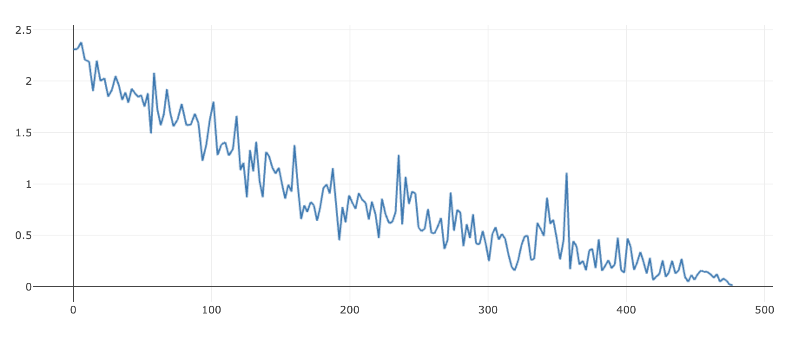
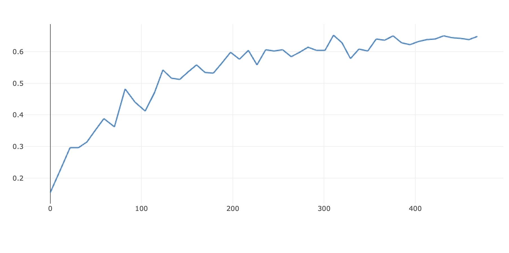

# command_classifier

## To run the script
The dataset is downloaded from ref[1] in the paper [Speech Commands: A Dataset for Limited-Vocabulary Speech Recognition](https://arxiv.org/abs/1804.03209). And only the numbers are kept in the original dataset. 

Rename this folder into dataset
```bash
├── dataset/
│   ├── zero/
│   ├── one/
:	:
│   ├── nine/
```
Prepare the config file `params.py`

Prepare the dataset by using `feature_extract=True` in `run.sh`

Add `--half_lr` after `python3 prepare_dataset.py` if you want decrease the learning rate on plateau. 

To train a LSTM model, use `train=True` in `run.sh`, the model will be saved as `exp/classifier.pth`. 

Test it by using `test=True` in `run.sh` 

## Result
#### No augmentation, use 300 audios per number to train
| Name  | Value |
| ------------- | ------------- |
| lr  | 0.003 with plateau |
| model_layers  | 3  |
| num_epoch  | 50  |

Loss & Accuracy: 0.89:
<p float="left">
  
  
</p>
Models : figs/model-300.pth

### No augmentation, use 50 audios per number to train
| Name  | Value |
| ------------- | ------------- |
| lr  | 0.003 with plateau |
| model_layers  | 3  |
| num_epoch  | 50  |

Loss & Accuracy: 0.648:
<p float="left">
  
  
</p>
Models : figs/model-50.pth

### With augmentation, use 50 audios per number to train, add dropout
| Name  | Value |
| ------------- | ------------- |
| lr  | 0.003 with plateau |
| model_layers  | 3  |
| num_epoch  | 50  |

Accuracy: 0.69 (figures are in figs/)

