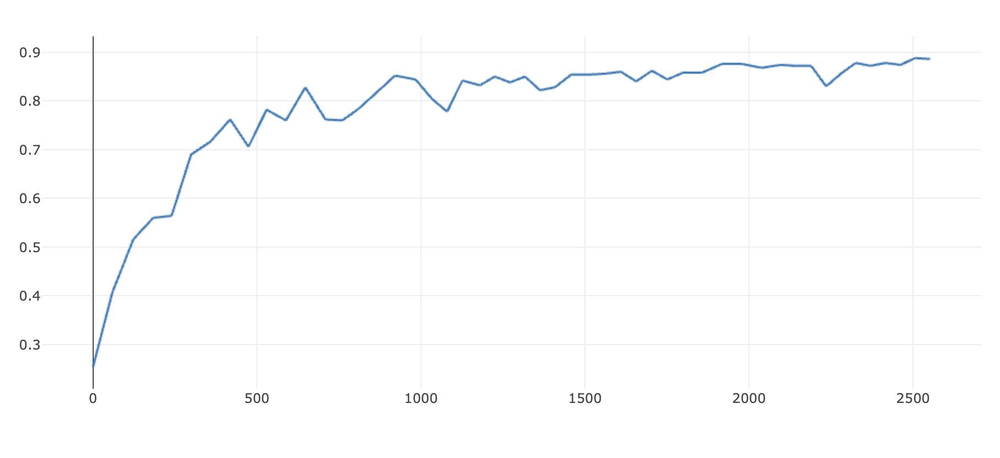

# command_classifier

## To run the script
The dataset is downloaded from ref[1] in the paper [Speech Commands: A Dataset for Limited-Vocabulary Speech Recognition](https://arxiv.org/abs/1804.03209). And only the numbers are kept in the original dataset. 

Rename this folder into dataset
```bash
├── dataset/
│   ├── zero/
│   ├── one/
:	:
│   ├── nine/
```
Prepare the config file `params.py`

Prepare the dataset by using `feature_extract=True` in `run.sh`

Train a LSTM model by using `train=True` in `run.sh`

## Result
### No augmentation, use 300 audios per number

accuracy: 0.82
Loss:

Accuracy:
